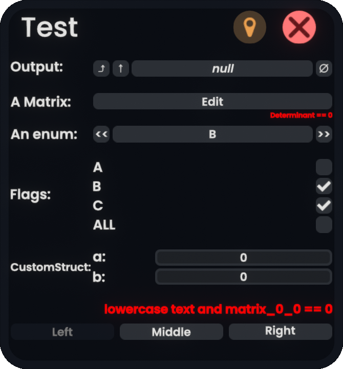
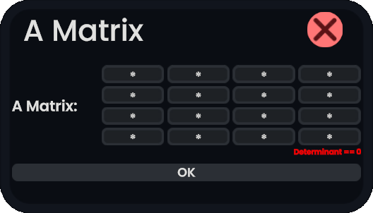

# ResoniteUIXDialogBuilder
[](https://github.com/mpmxyz/UIXDialogBuilder/actions/workflows/build-monkey.yml)
[](https://github.com/mpmxyz/UIXDialogBuilder/actions/workflows/build-rml.yml)

A library mod for Resonite that allows other mods to spawn UIX dialogs based on mod-defined classes.

## Installation (ResoniteModLoader)
1. Install [ResoniteModLoader](https://github.com/resonite-modding-group/ResoniteModLoader).
2. Download [release zip file](https://github.com/mpmxyz/UIXDialogBuilder/releases/latest/download/UIXDialogBuilder-ResoniteModLoader.zip) and extract contents into Resonite directory. (e.g. rml_mods should be merged with rml_mods.)
3. Start Resonite. (with ```-LoadAssembly Libraries/ResoniteModLoader.dll``` launch option)

## Installation (MonkeyLoader)
1. Install [MonkeyLoader](https://github.com/Banane9/MonkeyLoader).
2. Add package source "https://nuget.pkg.github.com/mpmxyz/index.json"
3. Add package "mpmxyz.UIXDialogBuilder.MonkeyLoader"
4. Start Resonite.

## Usage (End User)

### Overview

A typical dialog looks like this:

Notable features visible:
- a title, a button to pin to the user and a button to close the dialog
- multiple inputs, possibly augmented with error information
  - secret values not exposed to world space (here: ```A Matrix```)
    - Editing is done in a user space dialog:
	  
    - There is no 'cancel' button as the value is edited as-is.
  - improved editing of ```Flag``` enumeration values
- a row of actions to possibly conclude the dialog
  - A mod creator may enable certain actions to be usable for all users in a world.
  - Default is that they are disabled except for the dialog creator.
- TODO: mod settings

## Usage (Mod Developer)

### Dependencies
#### Resonite Mod Loader
1. Install the Resonite Mod Loader variant of the mod locally
2. Add Reference to ```$(ResonitePath)\rml_mods\mpmxyz.UIXDialogBuilderMod.ResoniteModLoader.dll``` in ```*RML.csproj```
3. Add a step in ```.github/workflows/build-rml.yml``` workflow to download the dll from latest release to the path given in the previous step.

#### MonkeyLoader

1. Install the MonkeyLoader variant of the mod locally
2. Make sure the package source https://nuget.pkg.github.com/mpmxyz/index.json is set up.
3. Add PackageReference to ```mpmxyz.UIXDialogBuilder.MonkeyLoader``` in ```*MonkeyLoader.csproj```

### Hello World
1. Create a class that represents the state of the dialog:
    ```cs
    class HelloWorldDialogState : IDialogState
    {
        [DialogOption("Name")]
        string name = "World";

        [DialogOption("Output")]
        IField<string> output;

        //set when bound to dialog, unset when unbound
        public Dialog Dialog
        {
            set;
            get;
        }

        [DialogAction("Write", isPrivate: false)]
        public void OnWrite()
        {
            UniLog.Log($"{Dialog}, {Dialog?.Slot}, {Dialog?.Slot?.World}");
            Dialog.Slot.World.RunSynchronously(() => {
                if (output != null) output.Value = $"Hello {name}!";
            });
        }

        public void Dispose()
        {
            Dialog.Slot.World.RunSynchronously(() => {
                if (output != null) output.Value = $"Goodbye!";
            });
        }

        public IDictionary<object, string> UpdateAndValidate(object key)
        {
            var errors = new Dictionary<object, string>();

            if (output == null)
            {
                errors.Add(nameof(output), "No output!");
            }

            return errors;
        }
    }
    ```
2. Configure a dialog builder:
    ```cs
    //default configuration displays all annotated options and actions
    var builder = new DialogBuilder<TestDialogState>();
    ```
3. Create a dialog instance:
    ```cs
    World world = ...;
    //creates a dialog in the world of your choice
    (Dialog dialog, Slot window) = builder.BuildWindow("Test", world, new TestDialogState());
    ```
    Notes:
    - The builder can be reused.
    - The state may be bound to another dialog after it has been unbound. (assignment to ```Dialog```)

### Dialog customization
#### 
#### Dialog class
#### Attributes
- TODO
#### Mapping of types
- TODO
#### Custom editors
#### 
- TODO: attributes
- TODO: ```Dialog``` class
- TODO: mapping of types
- TODO: custom editors
- TODO: more details on secret fields/private actions